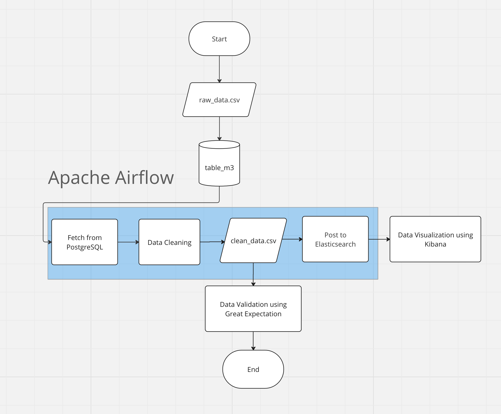

# P2M3 - Steps

## Flowchart



## Steps
Step by step pengerjaan Milestone 3 : 

1. Clone repository https://github.com/ardhiraka/DEBlitz

2. Buat sebuah folder baru di local computer, misalkan **project-m3**.

3. Copy dua buah file yaitu `.env` dan `airflow_ES.yaml` yang berada pada repository yang baru saja Anda clone pada path `DEBlitz/compose_file/airflow/` ke dalam folder baru tadi yang berada di local computer (folder "project-m3").

4. Ubah sintaks pada docker compose `airflow_ES.yaml` agar data yang dimasukkan ke dalam PostgreSQL dapat dibuka dilain waktu.
  
   *BEFORE*
   ```
   services: 
     postgres:
       image: postgres:13
       container_name: postgres
       ports:
         - "5434:5432"
       healthcheck:
         test: ["CMD", "pg_isready", "-U", "airflow"]
         interval: 5s
         retries: 5
       env_file:
         - .env
   ```

   *AFTER*
   ```
   services: 
     postgres:
       image: postgres:13
       container_name: postgres
       volumes:
         - ./postgres_project_m3:/var/lib/postgresql/data
       ports:
         - "5434:5432"
       healthcheck:
         test: ["CMD", "pg_isready", "-U", "airflow"]
         interval: 5s
         retries: 5
       env_file:
         - .env
   ```

5. Perhatikan bagian `x-common` pada Docker Compose.
   ```
   x-common:
     &common
     image: apache/airflow:2.3.4
     user: "${AIRFLOW_UID:-50000}:0"
     env_file: 
       - .env
     volumes:
       - ./dags:/opt/airflow/dags
       - ./logs:/opt/airflow/logs
       - ./plugins:/opt/airflow/plugins
       - /var/run/docker.sock:/var/run/docker.sock
   ```

   Terlihat bahwa docker akan melakukan mapping pada folder `dags`, `logs`, dan `plugins`. Oleh karena itu, buat terlebih dahulu 3 folder ini pada folder `project-m3` sehigga struktur foldernya akan menjadi : 

   ```
   project-m3
   |
   ├── .env
   ├── airflow_ES.yaml
   ├── /dags
   ├── /logs
   ├── /plugins
   ```

6. Buka Terminal atau Commad Prompt. Jalankan docker compose `airflow_ES.yaml` yang terletak di folder `project-m3`.

7. Masukkan `raw_data.csv` ke dalam PostgreSQL. Silakan buat sintaks DDL & DML-nya.

8. Untuk mengakses suatu service baik dari sisi user (developer) maupun dari sisi service lain, silakan buka `airflow_ES.yaml`. Perhatikan bagian `services`
    * Contoh dibawah ini adalah bagian `postgres`
      ```
      postgres:
        image: postgres:13
        container_name: postgres
        ports:
          - "5434:5432"
        healthcheck:
          test: ["CMD", "pg_isready", "-U", "airflow"]
          interval: 5s
          retries: 5
        env_file:
          - .env
      ```

    * Hostname
      - Jika user (developer) ingin mengakses service `postgres` ini, maka masukkan `localhost` sebagai hostname-nya.
      - Jika suatu service (misalka `Apache Airflow`) ingin mengakses service `postgres` ini, masukkan nama servicenya yaitu `postgres`.

    * Port
      - Tertulis 
        ```
        ports:
          - "5434:5432"
        ```
      - Angka sebelum titik dua (`:`) yaitu `5434` adalah port yang bisa dipakai oleh seorang user (developer).
      - Angka setelah titik dua (`:`) yaitu `5432` adalah port yang bisa dipakai oleh suatu service (Apache Airflow).

    * Lakukan konfigurasi sesuai dengan panduan `Hostname` dan `Port` diatas untuk service `Apache Airflow`, `Elasticsearch`, dan `PostgreSQL`.
